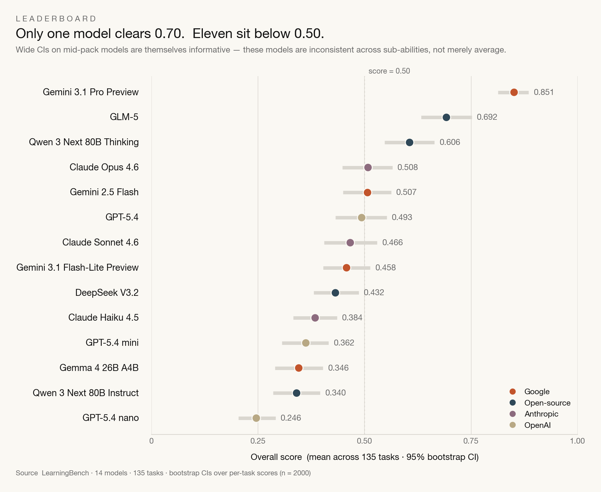

# LearningBench

**Measuring Inference-Time Learning in LLMs** — a Kaggle benchmark by [Treow Intelligence](https://treow.ai).

[](https://www.kaggle.com/c/learning-eval)

---

## What is LearningBench?

Existing benchmarks measure what models already *know*. **LearningBench measures how they learn** — from scratch, inside a single conversation, on systems that have never existed before.

Across **138 tasks** in six cognitive learning sub-abilities, we score not just whether a model infers the hidden concept, but:

- *How many examples it needed*
- *Whether its performance improved with practice*
- *How efficiently it spent a finite interaction budget*

No current benchmark measures any of this.

---

## The Six Sub-Abilities

| Sub-ability | Tasks | Protocol | What it isolates |
|---|---|---|---|
| **Associative Learning** | 17 | Single-turn | Causal inference vs. correlation (blocking, spurious cues) |
| **Concept Formation** | 18 | Interactive | Meta-calibration: *does the model know when it has seen enough?* |
| **Language Learning** | 26 | Interactive | Productive rule induction (wug-test on invented phonologies) |
| **Observational Learning** | 30 | Single-shot | Structural inference from demonstrated behavior alone |
| **Procedural Learning** | 11 | Multi-episode | Learning *trajectory*: did performance improve with practice? |
| **Reinforcement Learning** | 30 | Multi-turn | Hypothesis updating from feedback under a finite action budget |

---

## Headline Results

14 models · 138 tasks · all claims below confirmed with formal hypothesis tests (Spearman, Mann-Whitney, Wilcoxon), 10,000-sample bootstrap 95% CIs, and Benjamini-Hochberg FDR correction.

- Only **Gemini 3.1 Pro Preview** clears 0.70 (scores 0.85)
- **11 of 14 models** score below 0.50
- **GLM-5 (open-source)** ranks #2, outranking every closed-source lab except Google
- **Google + open-source** score +40.8% higher on rule induction than Anthropic + OpenAI



---

## Repository Structure

```
learning_eval/
│
├── README.md                        ← You are here
├── WRITEUP.md                       ← Full Kaggle competition writeup
├── SCORING.md                       ← Scoring formulas for all six sub-abilities
├── TASKS.md                         ← Task taxonomy and descriptions
├── requirements.txt                 ← Python dependencies
│
├── figures/                         ← All publication figures (PNG)
│   ├── fig_leaderboard_ci.png       ← Leaderboard with 95% CIs
│   ├── fig_radar_profiles.png       ← Per-model cognitive ability profiles
│   ├── fig_task_difficulty.png      ← Task difficulty distribution
│   ├── fig_thinking_vs_instruct.png ← Thinking vs. instruct comparison
│   ├── fig_tokens_vs_score.png      ← Token spend vs. score (RL)
│   ├── fig_trajectory_orthogonal.png ← Procedural trajectory orthogonality
│   └── fig_meta_calibration.png     ← Evidence-seeking efficiency scatter
│
├── sub_benchmarks/                  ← Per-sub-ability documentation
│   ├── learningbench_details.md     ← Overall benchmark design
│   ├── associative_learning.md
│   ├── concept_formation.md
│   ├── language_learning.md
│   ├── observational_learning.md
│   ├── procedural_learning.md
│   └── reinforcement_learning.md
│
├── leaderboard/                     ← Leaderboard CSVs
│   ├── leaderboard_flat.csv         ← Flat model × category scores
│   ├── leaderboard_model_ranks.csv  ← Model ranks
│   └── leaderboard_score_matrix.csv ← Full score matrix by model
│
├── scripts/
│   └── download_tasks.py            ← Download Kaggle kernel task files
│
├── downloaded_tasks/                ← Task source files by category
│   ├── associative_learning/
│   ├── concept_learning/
│   ├── language_learning/
│   ├── observational_learning/
│   ├── procedural_learning/
│   └── reinforcement_learning/
│
├── analysis/
│   ├── utils/
│   │   ├── data_loader.py           ← Load & parse leaderboard JSONs → DataFrames
│   │   └── stats.py                 ← Shared statistical helpers
│   │
│   ├── scripts/                     ← Analysis pipeline (numbered in run order)
│   │   ├── README.md                ← Script catalog — what each script does
│   │   ├── 04_discriminatory_power.py
│   │   ├── 05_cross_category.py
│   │   ├── ...
│   │   ├── 30_hypothesis_tests.py
│   │   └── make_writeup_figures.py
│   │
│   ├── outputs/                     ← All generated CSV outputs and figures
│   │   ├── score_matrix.csv         ← Primary data: model × task scores (all 157 tasks)
│   │   ├── score_matrix_phase_d.csv ← Curated data: model × task scores (138 tasks)
│   │   ├── model_stats.csv          ← Per-model overall statistics
│   │   ├── task_stats.csv           ← Per-task statistics
│   │   ├── ...                      ← (see analysis/outputs/README.md for full list)
│   │   ├── figures/                 ← Charts from analysis pipeline
│   │   ├── charts/                  ← Phase C comparison charts
│   │   ├── efficiency_charts/       ← Token/cost efficiency charts
│   │   └── novelty_claims/          ← Novelty comparison CSVs
│   │
│   ├── procedural_trajectory_ablation/
│   │   ├── trajectories.csv         ← Raw procedural learning trajectories
│   │   └── trajectory_summary.csv
│   │
│   ├── PHASE_A_INSIGHTS.md          ← Data extraction & foundation analysis
│   ├── PHASE_B_INSIGHTS.md          ← Deep analysis (discrimination, scaling, entropy)
│   ├── PHASE_C_INSIGHTS.md          ← Robustness, ablation & final synthesis
│   ├── PHASE_D_INSIGHTS.md          ← Final benchmark curation (19 tasks removed)
│   └── CURATION_DECISIONS.md        ← Curation rationale and task-level verdicts
│
└── docs/
    └── internal/                    ← Internal project documents (not needed to reproduce)
```

---

## Quick Start: Reproduce the Analysis

### Prerequisites

```bash
pip install -r requirements.txt
```

You will also need a [Kaggle API token](https://www.kaggle.com/docs/api) (`~/.kaggle/kaggle.json`) if you want to download raw kernel logs.

### Option A — Use the pre-computed CSVs (recommended)

All analysis outputs are included in `analysis/outputs/`. You can load them directly:

```python
import pandas as pd

# Primary score matrix (all 157 tasks, pre-curation)
df = pd.read_csv("analysis/outputs/score_matrix.csv")

# Curated score matrix (138 tasks after Phase D curation)
df_curated = pd.read_csv("analysis/outputs/score_matrix_phase_d.csv")

# Per-model statistics
model_stats = pd.read_csv("analysis/outputs/model_stats.csv")

# Per-task statistics (discrimination, entropy, flags)
task_stats = pd.read_csv("analysis/outputs/task_stats.csv")
```

### Option B — Re-run the full analysis pipeline

Scripts are numbered in dependency order. Run from the repo root:

```bash
# Step 1: Run the core analysis scripts (04–21)
cd analysis/scripts
python 04_discriminatory_power.py
python 05_cross_category.py
python 06_scaling_analysis.py
# ... continue through 21_novelty_claims_analysis.py

# Step 2: Formal hypothesis tests
python 30_hypothesis_tests.py

# Step 3: Regenerate writeup figures
python make_writeup_figures.py
```

See [`analysis/scripts/README.md`](analysis/scripts/README.md) for a complete description of what each script does and what it outputs.

### Option C — Download raw task files

To download the task kernel files from Kaggle (not needed for analysis):

```bash
python scripts/download_tasks.py
```

---

## The Score Matrix

The primary data file is `analysis/outputs/score_matrix_phase_d.csv`. Each row is one `(model, task)` score:

| Column | Description |
|---|---|
| `model` | Model display name (e.g., `"Gemini 3.1 Pro Preview"`) |
| `category` | Sub-ability key (`associative`, `concept`, `language`, `observational`, `procedural`, `rl`) |
| `category_full` | Human-readable category name |
| `task_name` | Task display name |
| `score` | Final composite score in [0, 1] |
| `tier` | Model tier (`frontier`, `mid`, `small`) |
| `provider` | Provider (`Google`, `OpenAI`, `Anthropic`, `Open-source`) |

---

## Scoring

Each sub-ability uses a distinct scoring formula. See [`SCORING.md`](SCORING.md) for the full technical specification.

**Shared primitives:**
- **Free exploration zone** — efficiency penalties begin only *after* the minimum evidence structurally required to see the pattern
- **Zero-accuracy floor** — every efficiency-weighted task returns 0.0 if accuracy is zero
- **Interactive tasks** (concept, language): `score = accuracy × (0.40 + 0.60 × efficiency)`
- **RL tasks**: `0.55×solved + 0.25×efficiency + 0.20×progress`
- **Procedural tasks**: OLS slope of practice-round accuracy — the only component in any major benchmark that directly measures whether learning occurred

---

## Benchmark Curation

The benchmark went through four analysis phases (A–D). Starting from 157 tasks:

- **Phase A**: Data extraction and validation
- **Phase B**: Item discrimination, entropy, scaling, and provider analysis
- **Phase C**: Robustness (leave-one-out), epistemic analysis, ground truth verification
- **Phase D**: Full code inspection of 26 flagged tasks → removed 19 (12.1%)

**Final: 138 tasks**. See [`analysis/CURATION_DECISIONS.md`](analysis/CURATION_DECISIONS.md) and [`analysis/PHASE_D_INSIGHTS.md`](analysis/PHASE_D_INSIGHTS.md) for the full rationale.

---

## Models Evaluated

| Model | Provider | Tier |
|---|---|---|
| Gemini 3.1 Pro Preview | Google | Frontier |
| GLM-5 | Open-source | Frontier |
| Claude Opus 4.6 | Anthropic | Frontier |
| GPT-5.4 | OpenAI | Frontier |
| Qwen 3 Next 80B Thinking | Open-source | Mid |
| Gemini 3.1 Flash-Lite Preview | Google | Mid |
| Gemini 2.5 Flash | Google | Mid |
| Claude Sonnet 4.6 | Anthropic | Mid |
| DeepSeek V3.2 | Open-source | Mid |
| GPT-5.4 mini | OpenAI | Mid |
| Claude Haiku 4.5 | Anthropic | Small |
| GPT-5.4 nano | OpenAI | Small |
| Qwen 3 Next 80B Instruct | Open-source | Small |
| Gemma 4 26B A4B | Google | Small |

---

## Citation

If you use LearningBench in your research, please cite:

```bibtex
@misc{learningbench2026,
  title   = {{LearningBench}: Measuring Inference-Time Learning in {LLMs}},
  author  = {Singh, Karandeep},
  year    = {2026},
  url     = {https://github.com/kdcyberdude/learning_eval},
  note    = {Treow Intelligence}
}
```

---

## References

1. Chollet, F. (2019). *On the Measure of Intelligence*. arXiv:1911.01547.
2. Srivastava, A. et al. (2022). *Beyond the Imitation Game (BIG-Bench)*. TMLR.
3. Chollet, F. et al. (2025). *ARC-AGI-2*. ARC Prize Foundation.
4. Morris, J. et al. (2026). *Measuring Progress Toward AGI: A Cognitive Framework*. Google DeepMind.
